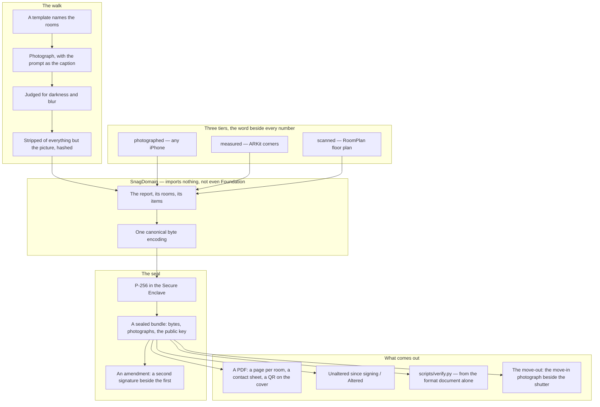
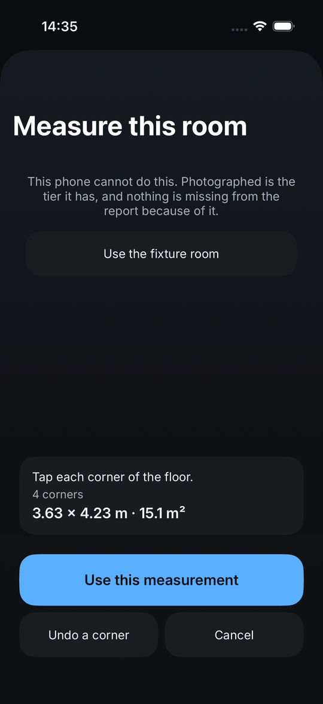
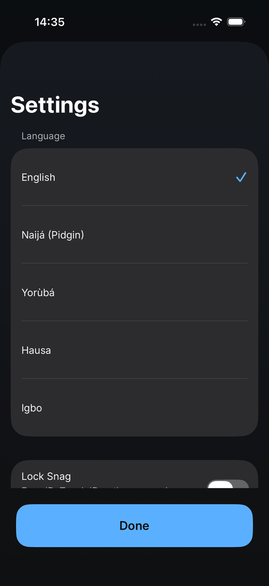

# Snag

A move-in and move-out condition report for Nigerian tenancies.

Snag makes the record on the day it can still be made honestly. The tenant
walks the flat room by room, photographs what is wrong and what is fine,
and seals the report with a key that never leaves the phone. The landlord
signs on the same phone. Anyone who opens the bundle later is told it is
unaltered since signing, or altered — and nothing in between. Native Swift,
iOS only, by decision.

<p align="center">
  
  
  
</p>

---

## 1. The problem

A Lagos tenant pays one or two years' rent in advance plus a caution fee
against damage. Two years later the landlord inspects, names the damage and
deducts, and the tenant argues about a cracked tile that was cracked on
move-in day and cannot prove it. Nobody wrote anything down. The Lagos
Tenancy Law says the deposit is refundable less lawful deductions; it does not
say how anybody establishes what was there before.

The dispute happens in two years to one tenant in ten. What every tenant does
on move-in day is walk the flat and notice what is wrong:

> **The evidence is the wedge, not the dispute.** A report is worth making for
> one tenant with no landlord on the other side, on day one.

### What it is not

**It is evidence, not proof.** A signature proves the report has not changed
since it was signed. It does not prove *when*, because the clock is the
phone's and there is no server. The fixes — a server timestamp, a notary, an
anchor — are each a different product with an account and a company holding
evidence about people's homes. The report says so on its own last page, and a
word-list gate keeps the stronger word out of the app in every language it
speaks. [ADR-0003](docs/adr/0003-the-report-is-evidence-not-proof.md).

**It is native and iOS only.** RoomPlan and ARKit are native frameworks with
no cross-platform equivalent, and the signature that makes the report worth
anything is a key in the Secure Enclave. A cross-platform Snag would be the
photographs tier alone — which is the camera roll with better filing. The case
was written before the code:
[ADR-0001](docs/adr/0001-snag-is-native-and-ios-only.md).

**It never says a number about money.** No deduction, no repair estimate. That
is the fintech line and the legal-advice line, and they are the same line.

**Nothing is sent.** No server, no account, no analytics, and a gate fails the
build on any network path in the source. The one exception — the tenant's own
iCloud, private database, opt-in, every bundle verified on the way down — is
confined to one folder and named in an ADR.

---

## 2. How it works



### The bytes come first

The report is one canonical byte encoding — big-endian, length-prefixed,
field-ordered, no floats — hand-written in a package that imports nothing,
and asserted byte-for-byte against a checked-in fixture. That fixture was
Phase 0's exit gate, ahead of any screen, because every signature ever made
is over bytes this package produces, and those bytes must not depend on any
platform encoder. The first draft signed `JSONEncoder` output; its key order
has changed between OS versions before, and a report signed on one iOS and
opened on the next would have verified as *altered* with nobody having done
anything.

### The seal, and the other side

The bytes are signed with a P-256 key in the Secure Enclave where there is
one. The sealed bundle carries the public key, so any phone with Snag — or
[`scripts/verify.py`](scripts/verify.py), two hundred lines written from
[`docs/BUNDLE-FORMAT.md`](docs/BUNDLE-FORMAT.md) alone with no dependencies —
says *unaltered since signing* or *altered*. CI runs both verifiers against
the app's own sealed bundle and eight tampers of it, and they must agree.

The landlord counter-signs on the tenant's phone, on glass, and the drawn
signature is bound into the bundle like a photograph. A report the landlord
signed is evidence the landlord has to explain away; a report only the tenant
signed is evidence the tenant made. A scan or a measurement added months
later is a second signature beside the first, touching nothing the first one
signed.

### Three tiers

| Tier | Needs | Gives |
|---|---|---|
| **photographed** | any iPhone | rooms named and photographed, every photo hashed |
| **measured** | A12 or later (2018 onward) | floor dimensions and area, ±5%, by tapping corners |
| **scanned** | LiDAR (12 Pro and later Pro) | a floor plan from a ninety-second walk |

The tier is beside every number, in the app and in the PDF. A phone that
cannot scan is never told it is missing something, because for that tenant
nothing is.

---

## 3. The app

Thirteen screens, one primary action each, pinned below the scroll.

### The walk

<p align="center">
  
  
  
</p>

A template names the rooms before the walk starts — self-contain to duplex.
The prompts above the shutter are what a Lagos flat has and a tenant forgets:
the meter, the water heater, the burglary bars. One tap on any of them
photographs with the caption started.

<p align="center">
  
  
  
</p>

Every photograph is judged for darkness and blur before it is hashed, and
stripped of EXIF and location. *Fine* is a real answer: a report that only
lists what is wrong reads as a complaint. Until the seal an item can be edited
or removed; after it, nothing.

### The seal

<p align="center">
  
  
  
</p>

The sealed screen runs the verifier over its own files every time it appears.
The third screen is the same bundle with one byte changed — a UI test flips
it and reads the word off the screen, because a verifier that has never seen
a tampered file is one nobody knows the behaviour of.

### Measured and scanned, short of the sensor

<p align="center">
  
  
  
</p>

On a phone, *Measure this room* is ARKit: the floor found, a corner per tap.
*Scan this room* is RoomPlan on a LiDAR phone: a walk, a floor plan, doors and
windows where they are. On the simulator, which has neither, a fixture room
stands in for both, so the arithmetic, the tier, the plan in the bundle and in
the PDF are all proved here; the five per cent against a tape measure is R1
and R2.

The PDF's cover carries a QR with the report id and the key's fingerprint, so
a printed copy can be matched to the bundle it came from. The bundle travels
as one file, because WhatsApp does not carry a folder. Five languages are
chosen in the app; the PDF keeps the English above the translation, because
the English is what was written.

> **Every screen above is the simulator, which has no camera.** The
> photographs are fixtures pushed through the pipeline the camera feeds, so
> the walk, the hashing, the seal, the PDF and the verifier are all exercised
> where only the sensor waits for hardware. `make screenshots` retakes the
> set.

---

## 4. What each layer does

### `SnagDomain` — the report, and its bytes

A Swift package that imports nothing — not Foundation — and
`make domain-purity` fails the build if it ever does. It holds the model
(the report, its rooms and items, the three tiers), the canonical encoding,
the floor arithmetic, the walk's rules, the comparison a move-out makes
against a move-in, and the amendment layer. `Dimension` is Foundation's, so
the domain has `Extent`; there is no `sin` without Foundation, so the test
that turns a rectangle brings a twelve-term series of its own. It tests in
seconds with no simulator and carries a 95% coverage gate.

### `Snag/Sealing` — the key, the bundle, the verifier

The Secure Enclave key, the signing, the bundle as a zip with the bytes, the
photographs and the public key, and the verifier the sealed screen runs over
its own files. A bundle that has gone bad on disk is listed under *Cannot be
read* and opens to *Altered*; twice a tampered bundle tried to disappear from
the list, and twice a rule was written so it is shown as what it is.

### `Snag/Capture`, `Snag/Measure` — the sensors, behind a source

The camera, the torch and the judge behind a `PhotoSource` with a fixture
implementation; ARKit and RoomPlan behind a `FloorSource` with a fixture
room. Every test runs against the fixtures; the sensors are the two gates that
wait on a handset. The plan renderer draws the floor into the bundle and the
PDF from the same points.

### `Snag/Report`, `Snag/Handover` — paper, and the other party

The PDF in Inter — one page per room, a contact sheet, the QR on the cover,
the last page that says what the report is and is not. The signature pad, the
counter-sign flow, the move-out changes view with the move-in photograph
beside the shutter, and the calendar reminder.

### `Snag/Speech` — five languages

English, Naijá, Yorùbá, Hausa and Igbo, 203 strings each; `make l10n-check`
fails on any string any language lacks, and `make copy-check` reads the
translations too — which is how it caught *burglary proof*, the Lagos term,
in the Pidgin, and was right to.

### `Snag/Depth`, `Snag/Cloud` — v1.1

The app lock, backup and restore, the seal nudge, Siri intents, the walk as a
Live Activity, and the iCloud mirror — the one network path, in one folder,
opt-in, every bundle verified on the way down.

---

## 5. Quick start

```bash
make setup        # nothing to install: Xcode 26 and the simulator runtime
make test-domain  # swift test on the domain package, in seconds
make test         # then the app's unit and UI tests on a headless simulator
make run          # build and launch on the booted simulator
make screenshots  # retake every README screenshot by test
```

The app launches with `-freshStore` under test and seeds a report from the
fixture photographs; `-tamper` flips the last byte of a sealed bundle so the
*Altered* path is a screen you can look at. A python verifier that agrees
with the app is one command:

```bash
python3 scripts/verify.py path/to/report.snag
```

**Requirements.** Xcode 26.6, iOS 17 or later. Every iPhone since 2018 for the
measured tier; a Pro with LiDAR for the scanned one. No Android — see
[§1](#1-the-problem).

---

## 6. Correctness notes

The parts that were harder than they looked, and the bugs that reached a
green suite.

### A tampered bundle tried to disappear, twice

The store listed only bundles that decoded. After `-tamper` the report
vanished from the list instead of being shown as altered; a rule was written.
Then the screenshot run found the two-bedroom template leaves the balcony
empty, so the flipped last byte landed on a room's item count, the report no
longer decoded, and it vanished again under the first rule's nose. A bundle
that has gone bad is listed under *Cannot be read* and opens to *Altered*; the
paper check says the same. The second rule against the same disappearance.

### The app was not in Inter

`DESIGN.md` had said "Inter, bundled" since Phase 0, `Type.swift` said
`.custom("Inter")`, and `UIFont(name: "Inter")` returned nil: the variable
font's PostScript name is `InterVariable`, and SwiftUI falls back to the
system face without a word. Found by the PDF test asking for the font's
family. `TypeTests` asks UIFont directly now, and `design-check` refuses any
font that is not relative to a text style.

### A mutation that does not apply proves nothing

The counts gate "did not fire" on a removed tier because the `sed` was one
space off and removed nothing. Applied properly, it fired on two documents.
Check the mutation landed before reading the result — the inverse of proving
a gate fires is a gate that passes for the wrong reason.

### The hang has had three explanations, and all three were wrong

"The test runner hung before establishing connection" — one run in three,
only the hosted unit bundle, the app never crashing, the UI runner never
hanging. A cold simulator; then our own scene delegate replacing SwiftUI's;
then a rebuild inside the same `xcodebuild test`. Each held for six clean
runs and then the host hung again with none of them present. The Makefile
retries the unit bundle up to three times and says so, and the three wrong
explanations stay in the journal because each one looked like proof for a
day.

### The audit's Dynamic Type check is not a Dynamic Type check

Three rows in a row on the paper-check screen were called "partially
unsupported" as the screen was rearranged. Screenshotted at L and at AX5,
every one of them scales. The check measures a row's growth in place, and a
row near the bottom of a list is clipped as it grows. The audit no longer
asks it; the source is checked for fixed sizes instead, and `.textClipped` at
the largest size says what a person would see. The same audit read a row
under a pinned button as visible, and the detail moved behind a link to a
screen with no pinned action — which is also where a reader wants it.

### The simulator has a passcode, and an unsigned app has no Keychain

Device-owner authentication does not fail on the simulator; it puts up a
passcode sheet of its own, and the test cancels it and reads *Not unlocked.
Try again.* `CODE_SIGNING_ALLOWED=NO` had been carried over from Tender,
which stores nothing; the Keychain answered -34018 to an app with no
application identifier.

### Phase 3 promised a thing the encoding cannot hold

"A snag placed on the plan" needs a coordinate on the item, and the item has
no such field. It went to the backlog with its reason — version 2, with an
ADR, after a real scan has been watched — rather than into a caption where a
number would pretend to be a word.

### Small ones that cost a build each

`16 == 16.0` is not true in a test macro. A per-word `capitalized` is not
sentence case — "Boys' Quarters". Two targets with one file name produce one
intermediate and the build refuses. A PDF loses its glyphs in extraction: the
"×" between two dimensions and the tone marks on Yorùbá both came back as
something else, so the tests read the words around them.

---

## 7. The documentation pipeline

Five documents move as the work moves, and a gate in
[`scripts/doc-check.sh`](scripts/doc-check.sh) runs in `make ci` and warns
when code has changed since the last journal entry.

| Document | Answers | Updated |
| --- | --- | --- |
| [`docs/JOURNAL.md`](docs/JOURNAL.md) | What did we do, and what surprised us? | Every session — `make journal` |
| [`CHANGELOG.md`](CHANGELOG.md) | What changed for someone using this? | Every user-visible change |
| [`docs/adr/`](docs/adr/) | Why is it built this way? | Any non-obvious decision — `make adr T="..."` |
| [`docs/ROADMAP.md`](docs/ROADMAP.md) + `PHASE` | Where are we, and what finishes this phase? | When a gate goes green |
| [`docs/RELEASE-GATES.md`](docs/RELEASE-GATES.md) | What blocks v1.0, and what would clear it? | When a gate is added or cleared |

[`docs/BUNDLE-FORMAT.md`](docs/BUNDLE-FORMAT.md) is public so anybody may
write a verifier, and one was: `scripts/verify.py` was written from it alone
and agreed with the app first time. [`docs/HANDSET-DAY.md`](docs/HANDSET-DAY.md)
is the script for the afternoon a phone is in a hand. `make counts-check`
derives every figure the README quotes — the tiers, the tests, the strings,
the languages, the ADRs, the gates, the screenshots — from the code and the
documents, eleven figures, so none can go stale silently.

---

## 8. Data handling

Everything is on the phone. There is no account, no server and no telemetry,
and a gate fails on any network path in the source.

| Class | Examples | Rule |
| --- | --- | --- |
| Never leaves the phone unless shared | Photographs, captions, floor plans, the sealed bundle | On the device; the only egress is a PDF or bundle the tenant shares themselves |
| Stripped before it is kept | EXIF, location, device model on every photograph | Removed before the hash, so the hash is of the picture and nothing else |
| Never asked for | Name, email, phone number of the tenant | The counter-signer's name and phone are typed by them, into the bundle they sign |
| The key | P-256 in the Secure Enclave | Never exported; the public half travels in the bundle so any reader can verify |
| Never a number about money | A deduction, an estimate | Not in the model, not in the copy, not in any language |
| The one exception | The tenant's own iCloud, private database | Opt-in, one folder, every bundle verified on the way down — [ADR-0005](docs/adr/0005-v1-1-five-languages-an-amendment-layer-and-the-tenants-own-icloud.md) |

---

## 9. Development

```bash
make ci           # everything CI runs: the gates, analyze, test, coverage
make gates        # the blocking gates alone, in seconds
make brandmark    # draw the mark at every size
make adr T="..."  # a new ADR, numbered and templated
make phase        # the current phase and its exit gate
make hooks        # install the pre-commit hook
```

**The gates**, each proved to fire by breaking it on purpose: `doc-check`
(every document present, tracked and current), `design-check` (DESIGN.md
agrees with the tokens; no fixed font size), `counts-check` (every figure a
document quotes is one the code produces), `copy-check` (nothing the app, the
PDF, the listing or any translation says claims proof), `l10n-check` (every
string in every language), `network-check` (no network path; CloudKit in one
folder only), `splash-check` (the launch screen paints the splash's colour),
`verify-check` (the Python verifier agrees with the app's own sealed bundle
and fires on eight tampers), `domain-purity` (the domain imports nothing),
`coverage-gate` (the domain above 95%), and the app suite on the simulator,
which fails on zero tests.

### Before a feature is called done

- The domain change is tested in the package, with no simulator
- Xcode's accessibility audit passes on every screen it touches, at two text
  sizes, excluding the two checks [§6](#6-correctness-notes) explains
- Every string is in the table, in all five languages, and the copy gate is
  green on all of them
- The sealed bundle still verifies under both verifiers, and every tamper
  still fails
- An ADR for any non-obvious decision; `CHANGELOG.md` and the journal updated
- `make ci` green

---

## 10. Layout

```text
SnagDomain/Sources/SnagDomain/  the model, the canonical bytes, the floor, the walk,
                                the comparison, the amendment — imports nothing
SnagDomain/Tests/               the fixture asserted to the byte; the rectangle turned
Snag/App/                       the app, the root view, routes, the quick action
Snag/Screens/                   the thirteen screens
Snag/Capture/                   the camera, the torch, the judge, behind PhotoSource
Snag/Measure/                   ARKit and RoomPlan behind FloorSource; the plan renderer
Snag/Sealing/                   the key, the bundle, the verifier, the zip
Snag/Report/                    the PDF and its text
Snag/Handover/                  the signature pad, counter-sign, the move-out changes
Snag/Speech/                    the strings, the prompts, the five translations
Snag/Depth/                     the lock, backup, the nudge, Siri, the Live Activity
Snag/Cloud/                     the iCloud mirror — the one network path
Snag/Design/                    palette, type, targets, the pinned action
Snag/Fixtures/                  the photographs the simulator walks with
SnagTests/, SnagUITests/        the unit suite; the UI suite under the accessibility audit
SnagWidgets/, SnagShared/       the Live Activity and what it shares with the app
scripts/verify.py               the second verifier, from the format document alone
scripts/                        the gates, the mark, the screenshots
docs/BUNDLE-FORMAT.md           the public format
docs/adr/                       the five decisions, and the thirty things with their lines
```

---

## 11. Status

**Phase 2 of 5 — measured, built short of the sensor.** Phase 1 is cleared: a
tenant walks the flat room by room, photographs what is wrong and what is
fine, and seals the report with a key that never leaves the phone. The
sealed bundle verifies itself on screen; one flipped byte and the screen says
*Altered*, proved by a UI test that flips it.

Thirty more features are planned and phased in
[ADR-0004](docs/adr/0004-thirty-things-and-the-line-each-does-not-cross.md),
and all thirty are built and proved on the simulator — templates and prompts,
the judge, EXIF stripped before the hash, the numbered PDF with a contact
sheet and a QR, the bundle as one file, the second verifier, the
counter-signature on glass, the move-out that says what changed, search, the
lock, backup, Siri, the walk on the Lock Screen. The measured and scanned
tiers are built too, and proved with a fixture room. v1.1's three — five
languages, the amendment layer, the tenant's own iCloud — the same day. What
waits is what always waited: a handset, a handover, a lawyer.

**The numbers.** 24 domain tests · 32 app unit tests · 16 UI tests under the
accessibility audit (a fixture writer among the first and the screenshot set
among the second skip until asked) · 203 strings in five languages
· 5 ADRs · 5 release gates · 13 screenshots.

| Phase | State |
| --- | --- |
| **0** Foundation | Cleared — builds and tests from the command line; the fixture asserted to the byte |
| **1** The report | Cleared — the walk, the seal, the PDF, the verifier, one byte flipped on screen |
| **2** Measured | **current** — built with a fixture room; the gate is a tape measure in a real room (R1) |
| **3** Scanned | Built with the same fixture; the gate is a LiDAR phone in a real flat (R2) |
| **4** Handover → v1.0 | Built — the counter-signature, the move-out, the paper check; the gates are a doorway (R3) and a lawyer (R4) |
| **5** Depth → v1.1 | Built — five languages, the amendment layer, iCloud; the gate is four readers (R5) |

### What is open, and why it matters

Five gates, in [`docs/RELEASE-GATES.md`](docs/RELEASE-GATES.md), block v1.0.

| Open | Blocks | Why it is not closed |
| --- | --- | --- |
| The ARKit tier within five per cent of a tape measure | v1.0 (R1) | A simulator has no camera and no motion sensors; the measured tier has never measured anything real |
| The RoomPlan tier on a real flat | v1.0 (R2) | A generator in the corner, a wardrobe against the wall, a window the sun comes through — and a plan that agrees with the tape |
| A real handover, watched | v1.0 (R3) | A tenant and a landlord in a doorway, one phone, two signatures. Every flow was designed by somebody who has not stood there |
| A tenancy lawyer reading the PDF for an hour | v1.0 (R4) | Not whether it is admissible; whether it overclaims |
| Each translation read by a native speaker | v1.1 (R5) | 203 strings each, gated for completeness and for overclaiming, never yet read by anybody who grew up in the language |

---

## 12. Licensing

Two licences, because the two halves have opposite jobs.

**The application is under the [Business Source License 1.1](LICENSE).** You
may run it in production to make, sign and keep condition reports for
tenancies you are party to or manage, including as part of a letting or
property-management service you provide. You may not offer Snag itself to
third parties as a hosted condition-report or evidence service. On
**2030-08-28** it converts to Apache-2.0 automatically, and that date moves
forward with each release.

**The domain package is Apache-2.0**: [`SnagDomain`](SnagDomain/LICENSE).

That split is the point. The bytes a signature is over come out of that
package, and the format is public, so that the other side of a tenancy
dispute — or their lawyer, or a court — can verify a report without reference
to the company that wrote the app. **Evidence that only its author can check
is not evidence.**

---

Read [`CHANGELOG.md`](CHANGELOG.md) for what changed and why,
[`docs/ROADMAP.md`](docs/ROADMAP.md) for the five phases and their gates,
[`docs/RELEASE-GATES.md`](docs/RELEASE-GATES.md) for what blocks v1.0,
[`docs/adr/`](docs/adr/) for the decisions — including
[the thirty things and the line each does not cross](docs/adr/0004-thirty-things-and-the-line-each-does-not-cross.md)
— [`docs/BUNDLE-FORMAT.md`](docs/BUNDLE-FORMAT.md) to write your own verifier,
and [`docs/00-PRODUCT-STATEMENT.md`](docs/00-PRODUCT-STATEMENT.md) for the
full problem analysis.
