# Snag

**A move-in and move-out condition report for Nigerian tenancies. Scan the room,
photograph what is wrong, get a dated report both sides sign — months before the argument
about the caution fee.**

A Lagos tenant pays one or two years' rent in advance plus a caution fee against damage.
Two years later the landlord inspects, names the damage and deducts, and the tenant argues
about a cracked tile that was cracked on move-in day and cannot prove it. Nobody wrote
anything down. The Lagos Tenancy Law says the deposit is refundable less lawful
deductions; it does not say how anybody establishes what was there before.

Snag makes the record on the day it can still be made honestly. The tenant walks the flat
room by room — a LiDAR phone produces a floor plan, any recent iPhone measures the rooms,
anything photographs them, and the app says which of the three it did beside every number.
Every defect is a photograph and a sentence, hashed the moment it is taken. The report is
a PDF and a signed bundle; the landlord or a witness signs on the tenant's phone; and
anyone can open the bundle later and be told it is unaltered since signing. At move-out,
the same walk, with the move-in photograph beside the new one.

See [`docs/00-PRODUCT-STATEMENT.md`](docs/00-PRODUCT-STATEMENT.md) for the full analysis.

> **This is the second native, iOS-only project in a portfolio of cross-platform ones**,
> and the reason is written down before any code:
> [ADR-0001](docs/adr/0001-snag-is-native-and-ios-only.md). RoomPlan and ARKit are native
> frameworks with no cross-platform equivalent, and the signature that makes the report
> worth anything is a key in the Secure Enclave. A cross-platform Snag would be the
> photographs tier alone — which is the camera roll with better filing.

> **It is evidence, not proof.** A signature proves the report has not changed since it was
> signed. It does not prove *when*, because the clock is the phone's and there is no
> server. The report says so on its own last page, and no sentence in the app claims more.
> [ADR-0003](docs/adr/0003-the-report-is-evidence-not-proof.md).

---

## The walk

<p align="center">
  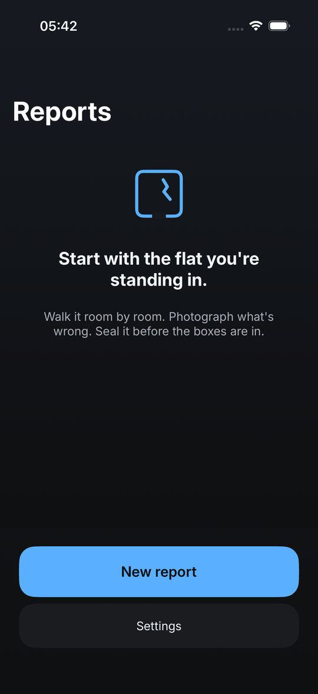
  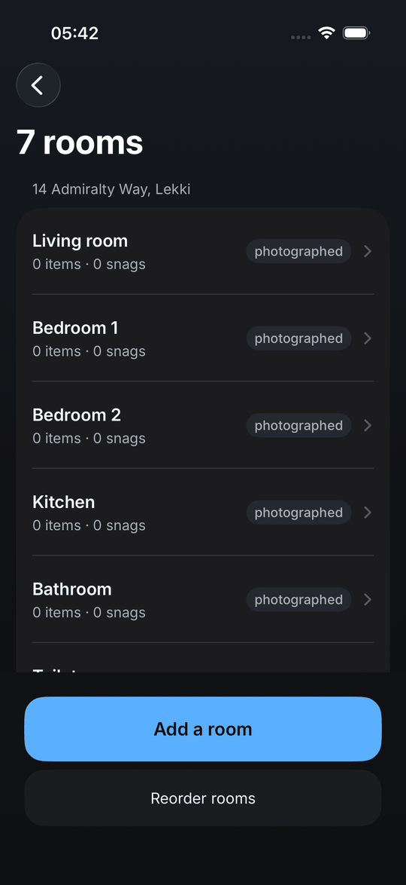
  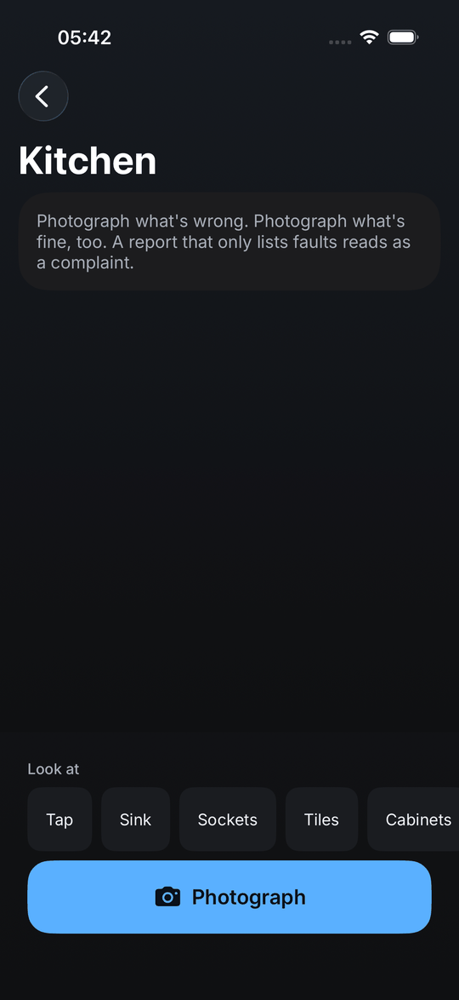
</p>

One primary action per screen, pinned below the scroll. A template names the rooms before
the walk starts; the prompts above the shutter are what a Lagos flat has and a tenant
forgets — the meter, the water heater, the burglary bars — and one tap on any of them
photographs with the caption started.

<p align="center">
  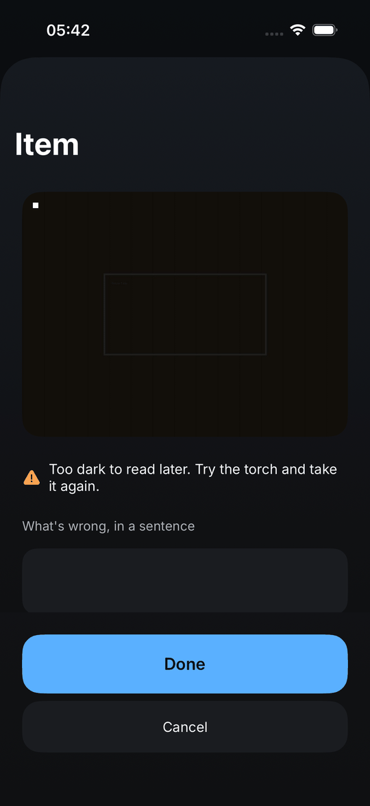
  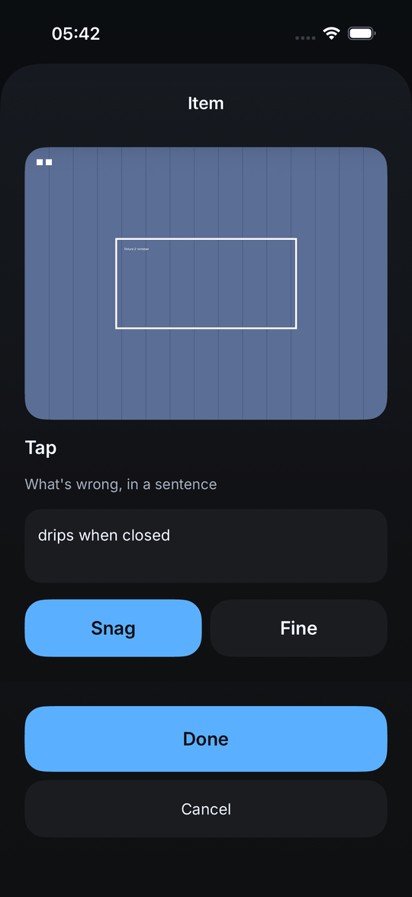
  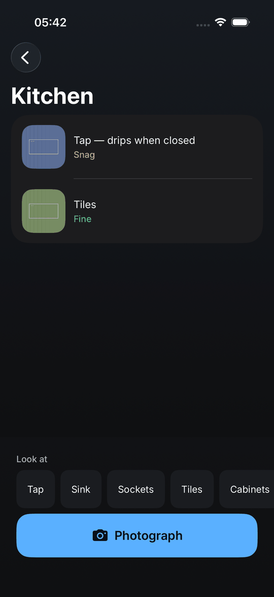
</p>

Every photograph is judged for darkness and blur before it is hashed, and stripped of
EXIF and location. *Fine* is a real answer: a report that only lists what is wrong reads
as a complaint. Until the seal an item can be edited or removed; after it, nothing.

## The seal

<p align="center">
  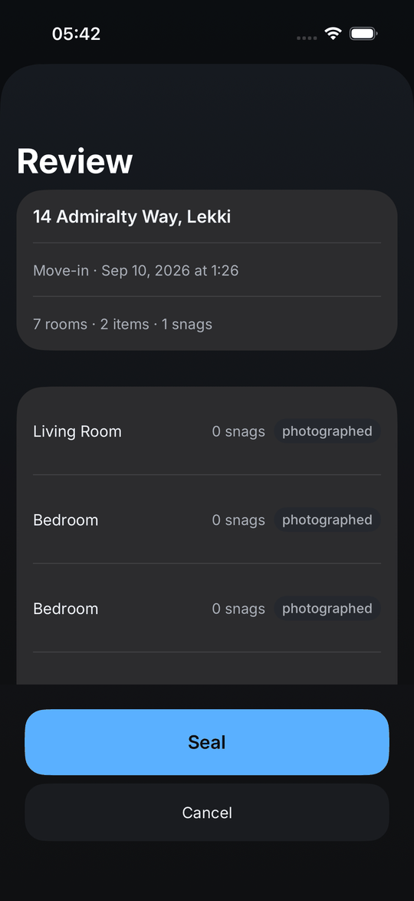
  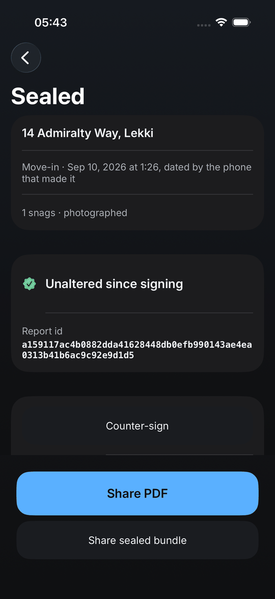
  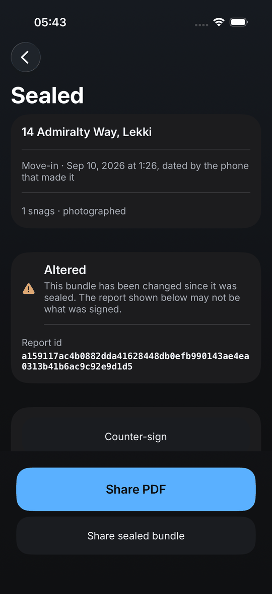
</p>

The sealed screen runs the verifier over its own files every time it appears. The third
screen is the same bundle with one byte changed — a UI test flips it and reads the word
off the screen, because a verifier that has never seen a tampered file is one nobody
knows the behaviour of.

> **Every screen above is the simulator, which has no camera.** The photographs are
> fixtures pushed through the pipeline the camera feeds, so the walk, the hashing, the
> seal, the PDF and the verifier are all exercised where only the sensor waits for
> hardware. `make screenshots` retakes the set.

## Status

**Phase 1 of 5 — the report.** A tenant walks the flat room by room, photographs what is
wrong and what is fine, and seals the report with a key that never leaves the phone. The
sealed bundle verifies itself on screen; one flipped byte and the screen says *Altered*,
proved by a UI test that flips it. The PDF has one page per room and a last page that says
what the report is and is not. The bundle format is public, in
[`docs/BUNDLE-FORMAT.md`](docs/BUNDLE-FORMAT.md), so anybody may write a verifier.

Thirty more features are planned and phased in
[ADR-0004](docs/adr/0004-thirty-things-and-the-line-each-does-not-cross.md), and all
thirty are built and proved on the simulator: templates and prompts that make the walk
faster, a judge for dark and blurred photographs, EXIF stripped before the hash, a numbered
PDF in Inter with a contact sheet and a QR that matches paper to a bundle, the bundle as
one file for WhatsApp, a second verifier in Python that CI runs against the app's own
bundle, the counter-signature drawn on glass, the move-out that shoots the same views and
says what changed, the calendar entry, search, the app lock, the seal nudge, backup and
restore, Siri, and the walk on the Lock Screen. What waits is what always waited: a
handset, a handover, a lawyer.

The pure-Swift domain — a report, its rooms and items, the three tiers, and that encoding
— lives in a package that imports nothing, not even Foundation, and tests in seconds with
no simulator. `make coverage-gate` will hold it above 95%.

## The paper, and the other phone

<p align="center">
  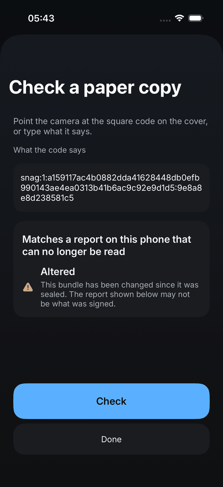
  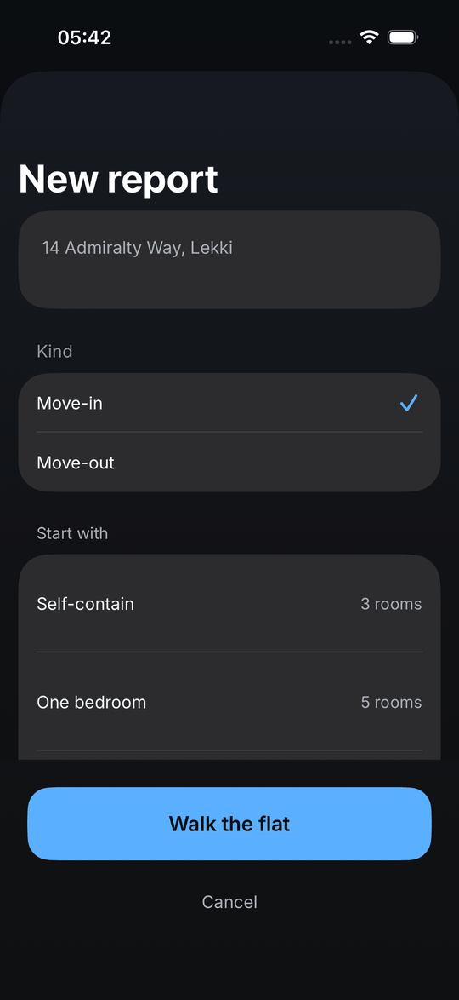
</p>

The PDF's cover carries a QR with the report id and the key's fingerprint, so a printed
copy can be matched to the bundle it came from. The bundle travels as one file, because
WhatsApp does not carry a folder, and opens on any phone with Snag to the same verdict —
or is checked by [`scripts/verify.py`](scripts/verify.py), written from
[`docs/BUNDLE-FORMAT.md`](docs/BUNDLE-FORMAT.md) alone with no dependencies, which CI runs
against the app's own sealed bundle and six tampers of it.

## Three tiers

| Tier | Needs | Gives |
|---|---|---|
| **photographed** | any iPhone | rooms named and photographed, every photo hashed |
| **measured** | A12 or later (2018 onward) | floor dimensions and area, ±5%, by tapping corners |
| **scanned** | LiDAR (12 Pro and later Pro) | a floor plan from a ninety-second walk |

The tier is beside every number, in the app and in the PDF. A phone that cannot scan is
never told it is missing something, because for that tenant nothing is.

## What blocks v1.0

Four gates, in [`docs/RELEASE-GATES.md`](docs/RELEASE-GATES.md). Two wait on handsets —
one ordinary, one with LiDAR — one on a real handover watched in a real doorway, and one on
a tenancy lawyer reading the PDF for an hour and not asking for a change.

## Working on it

```
make setup      # nothing to install: Xcode 26 and the simulator runtime
make test       # swift test on the domain package, then xcodebuild test on the simulator
make ci         # everything CI runs: the gates, analyze, test, coverage
make phase      # the current phase and its exit gate
```

Every phase has a one-sentence exit gate in [`docs/ROADMAP.md`](docs/ROADMAP.md). Every
non-obvious decision has an ADR in [`docs/adr/`](docs/adr/). Every session has a journal
entry in [`docs/JOURNAL.md`](docs/JOURNAL.md), and `make doc-check` warns when code has
changed since the last one.

**Requirements.** Xcode 26.6, iOS 17 or later. Every iPhone since 2018 for the measured
tier; a Pro with LiDAR for the scanned one. No Android — see above.
